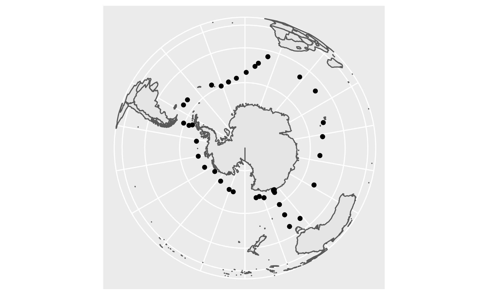
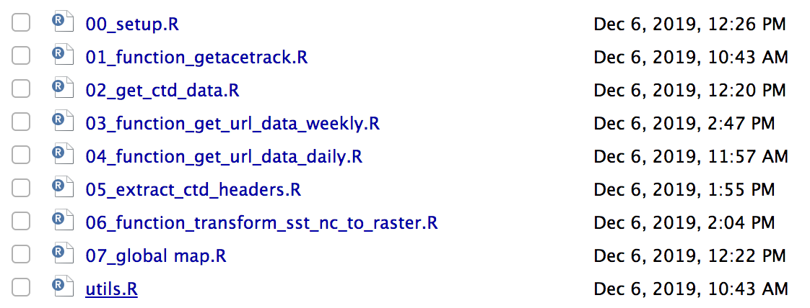

class: inverse, center, middle

## Introduction

Decembre 2016 à mars 2017 

---
## Données utilisées 

- Antarctic Circumnavigation Expedition
  - Trajectoire GPS du navire 
  
  

- Données environnementales (Aqua-MODIS)

  - Sea Surface Temperature 
  - Chlorophyll a 

source : [https://oceancolor.gsfc.nasa.gov/]

---

## Fonctions utilisées 

---
## Trajet du bateau 

---